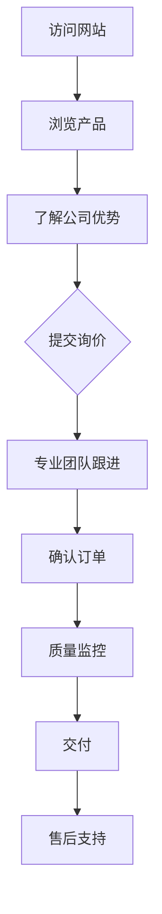

## 1. Product Overview
专业外贸企业网站，服务中国出口企业，主营细胞冻存复苏设备、汽配产品及工业检测仪器，帮助海外客户找到优质中国供应商，建立长期合作关系。
- 目标用户：海外采购商、实验室/医院采购部门、汽配经销商、工业设备采购商
- 市场价值：提供一站式采购服务，解决海外客户在中国采购的痛点（语言障碍、质量管控、供应链管理）

## 2. Core Features

### 2.1 User Roles
| Role | Registration Method | Core Permissions |
|------|---------------------|------------------|
| Guest User | None | Browse products, view company info, submit inquiry |
| Registered User | Email registration | Track inquiries, save favorites, access premium content |

### 2.2 Feature Module
1. **首页**: Hero区、产品分类展示、公司优势、客户评价、快速联系
2. **产品中心**: 产品分类浏览、产品详情、技术参数、OEM/ODM定制信息
3. **关于我们**: 公司简介、外贸团队介绍、服务流程、资质证书
4. **联系我们**: 联系方式、询价表单、地图定位

### 2.3 Page Details
| Page Name | Module Name | Feature description |
|-----------|-------------|---------------------|
| 首页 | Hero Section | 动态轮播展示公司核心优势和主打产品 |
| 首页 | Product Categories | 三大产品类别卡片展示，点击进入对应分类 |
| 首页 | Company Advantages | 突出显示专业外贸团队、20年经验、OEM/ODM服务 |
| 首页 | Testimonials | 客户评价展示，增强信任感 |
| 产品中心 | Category Filter | 按产品类别筛选（细胞冻存/汽配/工业仪器） |
| 产品中心 | Product List | 产品卡片列表，展示图片、名称、核心卖点 |
| 产品中心 | Product Detail | 详细产品信息、技术参数、应用场景 |
| 关于我们 | Company Profile | 公司介绍、发展历程、团队实力 |
| 关于我们 | Service Process | 从询盘到交付的完整服务流程 |
| 关于我们 | Certifications | 资质证书展示 |
| 联系我们 | Contact Form | 专业询价表单，包含产品需求、数量等字段 |
| 联系我们 | Contact Info | 电话、邮箱、地址等联系方式 |

## 3. Core Process
用户访问网站 → 浏览产品 → 了解公司优势 → 提交询价 → 专业团队跟进 → 确认订单 → 质量监控 → 交付 → 售后支持

## 4. User Interface Design
### 4.1 Design Style
- **主色调**: 深蓝色(#0A1628) + 科技蓝(#0066CC)，体现专业、信任、国际化
- **辅助色**: 活力橙(#FF6B35)，用于CTA按钮和强调元素
- **按钮风格**: 圆角矩形，渐变背景，悬停效果明显
- **字体**: 标题使用无衬线粗体，正文使用清晰易读的无衬线字体
- **布局风格**: 卡片式布局，层次分明，信息密度适中
- **图标风格**: 简洁现代的线性图标

### 4.2 Page Design Overview
| Page Name | Module Name | UI Elements |
|-----------|-------------|-------------|
| 首页 | Hero Section | 全屏背景，大标题，副标题，CTA按钮，动态背景效果 |
| 首页 | Product Categories | 三列卡片，产品图片+名称+简短描述，悬停放大效果 |
| 首页 | Company Advantages | 图标+标题+描述，四列布局 |
| 首页 | Testimonials | 引用样式，客户名称和公司，轮播展示 |
| 产品中心 | Category Filter | 横向标签切换，响应式布局 |
| 产品中心 | Product List | 网格布局，产品卡片，价格/起订量显示 |
| 产品中心 | Product Detail | 左侧大图，右侧详细信息，技术参数表格 |
| 关于我们 | Company Profile | 图文并茂，时间线展示发展历程 |
| 关于我们 | Service Process | 步骤卡片，流程图样式 |
| 关于我们 | Certifications | 证书图片网格展示 |
| 联系我们 | Contact Form | 表单字段清晰，提交成功反馈 |

### 4.3 Responsiveness
- 桌面端优先设计
- 平板端自适应布局调整
- 移动端：单列布局，汉堡菜单导航

### 4.4 Key Messages & Selling Points
- "近20年专业外贸经验"
- "真诚、诚信、双赢"
- "专业团队帮您选择工厂、监督质量"
- "支持OEM/ODM定制服务"
- "灵活付款方式"
- "全程质量监控，让您放心"
