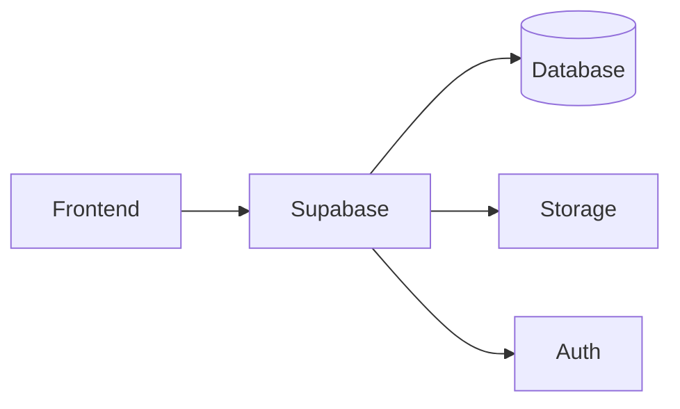
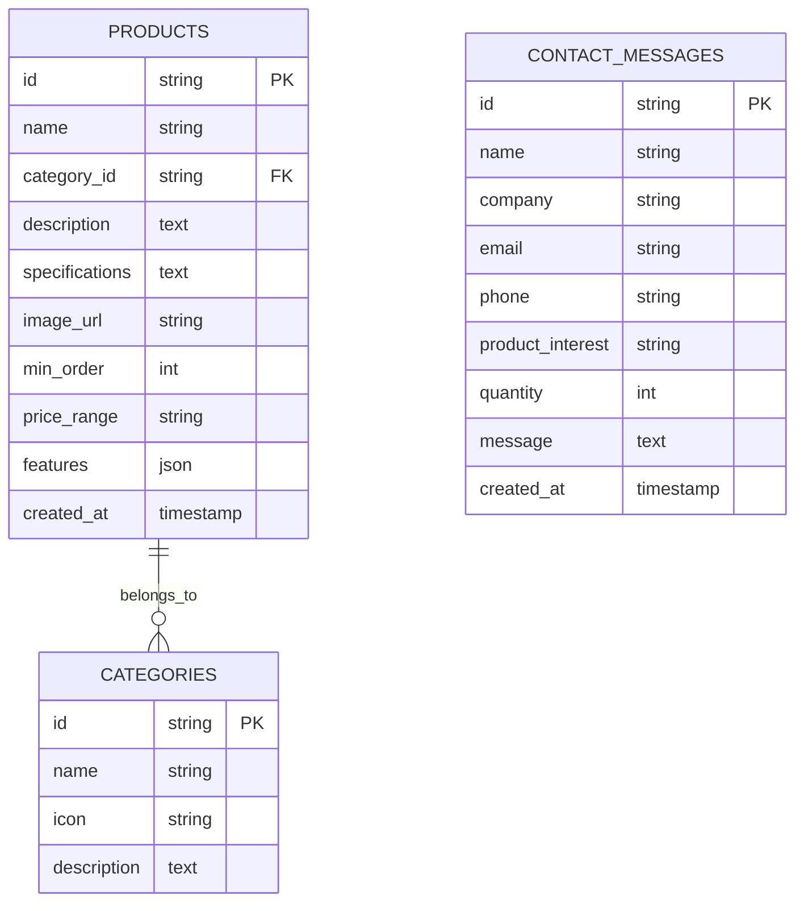

## 1. Architecture Design


## 2. Technology Description
- Frontend: React@18 + tailwindcss@3 + vite
- Initialization Tool: vite-init
- Backend: Supabase (auth, database, storage)
- Database: Supabase (PostgreSQL)

## 3. Route Definitions
| Route | Purpose |
|-------|---------|
| / | 首页 |
| /products | 产品中心 |
| /products/:id | 产品详情 |
| /about | 关于我们 |
| /contact | 联系我们 |

## 4. API Definitions
### 4.1 Products API
**GET /api/products** - 获取产品列表
```typescript
interface Product {
  id: string;
  name: string;
  category: 'cell-culture' | 'auto-parts' | 'industrial-instruments';
  description: string;
  specifications: string;
  imageUrl: string;
  minOrder: number;
  priceRange: string;
  features: string[];
}
```

**GET /api/products/:id** - 获取单个产品详情

### 4.2 Categories API
**GET /api/categories** - 获取产品分类
```typescript
interface Category {
  id: string;
  name: string;
  icon: string;
  description: string;
}
```

### 4.3 Contact API
**POST /api/contact** - 提交询价
```typescript
interface ContactForm {
  name: string;
  company: string;
  email: string;
  phone: string;
  productInterest: string;
  quantity: number;
  message: string;
}
```

## 5. Data Model
### 5.1 Data Model Definition


### 5.2 Data Definition Language
```sql
CREATE TABLE categories (
  id UUID PRIMARY KEY DEFAULT gen_random_uuid(),
  name VARCHAR(100) NOT NULL,
  icon VARCHAR(50),
  description TEXT,
  created_at TIMESTAMP DEFAULT NOW()
);

CREATE TABLE products (
  id UUID PRIMARY KEY DEFAULT gen_random_uuid(),
  name VARCHAR(200) NOT NULL,
  category_id UUID REFERENCES categories(id),
  description TEXT,
  specifications TEXT,
  image_url VARCHAR(500),
  min_order INT,
  price_range VARCHAR(100),
  features JSONB,
  created_at TIMESTAMP DEFAULT NOW()
);

CREATE TABLE contact_messages (
  id UUID PRIMARY KEY DEFAULT gen_random_uuid(),
  name VARCHAR(100) NOT NULL,
  company VARCHAR(100),
  email VARCHAR(200) NOT NULL,
  phone VARCHAR(50),
  product_interest VARCHAR(200),
  quantity INT,
  message TEXT,
  created_at TIMESTAMP DEFAULT NOW()
);

INSERT INTO categories (name, icon, description) VALUES 
('细胞冻存复苏设备', 'flask-conical', '细胞培养实验室专用设备'),
('汽配产品', 'car', '汽车零部件及配件'),
('工业检测仪器', 'gauge', '实验室及工业用检测仪器');
```

## 6. Project Structure
```
src/
├── components/
│   ├── Header.tsx
│   ├── Footer.tsx
│   ├── HeroSection.tsx
│   ├── ProductCard.tsx
│   ├── CategorySection.tsx
│   ├── AdvantageSection.tsx
│   ├── TestimonialSection.tsx
│   ├── ContactForm.tsx
│   └── ServiceProcess.tsx
├── pages/
│   ├── Home.tsx
│   ├── Products.tsx
│   ├── ProductDetail.tsx
│   ├── About.tsx
│   └── Contact.tsx
├── data/
│   └── products.ts
├── utils/
│   └── helpers.ts
├── App.tsx
├── main.tsx
└── index.css
```

## 7. Design Guidelines
- 使用深蓝色(#0A1628)作为主背景色
- 科技蓝(#0066CC)作为主色调
- 活力橙(#FF6B35)作为强调色
- 响应式设计，支持桌面端和移动端
- 使用lucide-react图标库
- 平滑滚动和悬停动画效果
